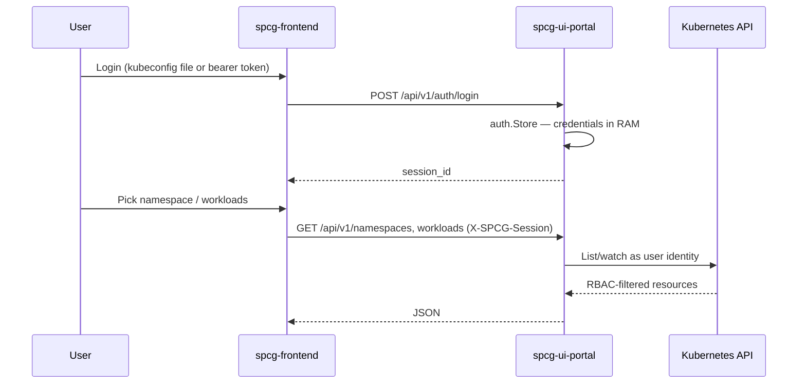
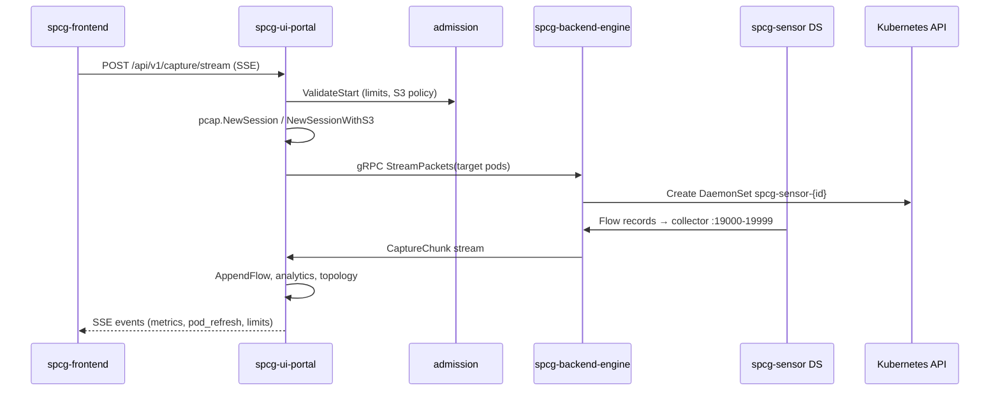
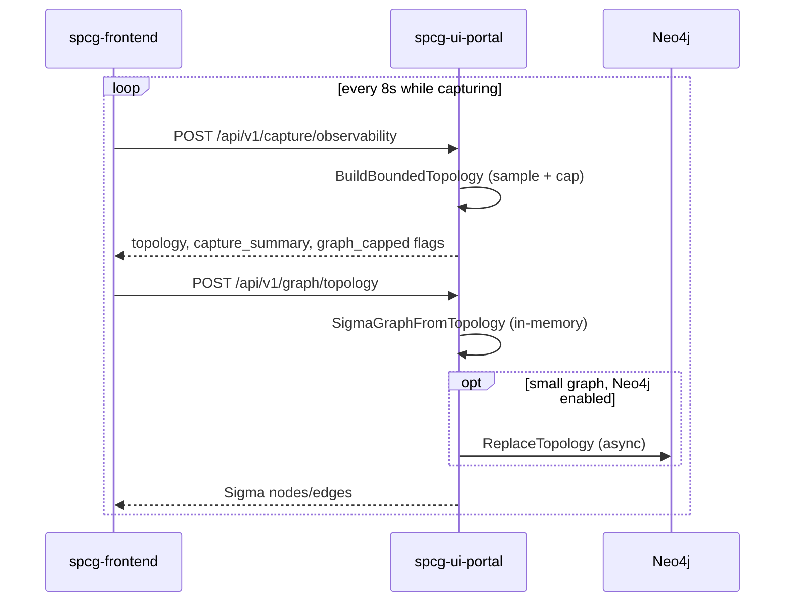

# SPCG application architecture

Secure Packet Capture Gateway (SPCG) is a **namespace-scoped, zero-trust** observability product that wraps [netobserv-cli](https://github.com/netobserv/netobserv-cli) / [netobserv-ebpf-agent](https://github.com/netobserv/netobserv-ebpf-agent) with a browser UI, admission-controlled captures, and optional graph + AI triage.

---

## 1. Design ideology

### 1.1 Problems we optimize for

| Problem | Approach |
|---------|----------|
| PCAP tools need cluster-admin or host access | User brings **their own** kubeconfig/OAuth token; portal impersonates that identity for list/capture only |
| Raw packets in the browser | **Thin frontend**: SSE metrics + aggregated topology; PCAP via download or presigned S3 URL |
| Multi-tenant graph leakage | Neo4j nodes keyed by `captureId` + `authSessionId`; labels encrypted with per-session material |
| Capture plane is inherently privileged | **Split namespaces**: privileged `pcap-capture` vs restricted `pcap-frontend` |
| High packet rates break the UI | **Bounded topology** (sampled events, capped nodes/edges); observability API separate from heavy AI/Neo4j sync |
| Long / large captures OOM the portal | **Tiered retention**: RAM PCAP with byte/time caps (Small); mandatory S3 streaming (Medium/Peak) |

### 1.2 Core concepts

| Concept | Definition |
|---------|------------|
| **Auth session** | UI login session (`X-SPCG-Session`). Holds kubeconfig or bearer token in memory on `spcg-ui-portal` only. |
| **Capture session** | One active or completed capture (`capture_session_id`). Owns flow metadata, PCAP path (RAM or S3), Neo4j subgraph. |
| **Capture plane** | `pcap-capture`: engine + per-session eBPF DaemonSets. |
| **Control plane (UI)** | `pcap-frontend`: Next.js + ui-portal + Neo4j. |
| **Sensor** | `spcg-sensor-{captureId}` DaemonSet: hostNetwork netobserv agent exporting gRPC flows to engine collector ports `19000–19999`. |
| **Admission** | ConfigMap-driven limits (`MAX_*`, `S3_OFFLOAD_ENABLED`) enforced in `internal/capture/admission` before SSE stream starts. |
| **Bounded graph** | Topology built from last N events with max nodes/edges for UI refresh under scan stress. |

### 1.3 Architectural style

- **Microservices (two binaries + optional Neo4j)**, not a monolith: engine never serves HTTP to users; portal never runs eBPF.
- **Event-driven capture path**: gRPC stream from engine → portal → SSE to browser.
- **Configuration as data**: tier differences are Kustomize overlays + ConfigMap, not compile-time forks.
- **Fail closed on auth**: missing/invalid session → 401; capture ownership checked per API (`capture_registry.go`).

---

## 2. Logical component model

```text
┌─────────────────────────────────────────────────────────────────────────┐
│                         User browser                                     │
│  spcg-frontend (Next.js) — static UI, proxies /api/v1 → ui-portal       │
└───────────────────────────────┬─────────────────────────────────────────┘
                                │ HTTPS (REST + SSE)
┌───────────────────────────────┴─────────────────────────────────────────┐
│  pcap-frontend (Pod Security: restricted)                                │
│  ┌─────────────────┐  ┌──────────────────┐  ┌─────────────────────┐ │
│  │ spcg-ui-portal  │  │ spcg-neo4j       │  │ ConfigMap admission │ │
│  │ Go HTTP API     │──│ optional graph   │  │ + secrets (graph,   │ │
│  │ auth, capture,  │  │ Sigma layout     │  │  neo4j password)    │ │
│  │ graph, AI       │  └──────────────────┘  └─────────────────────┘ │
│  └────────┬────────┘                                                     │
└───────────┼─────────────────────────────────────────────────────────────┘
            │ gRPC CaptureService (TLS optional via spcg-engine-mtls)
┌───────────┴─────────────────────────────────────────────────────────────┐
│  pcap-capture (Pod Security: privileged)                                   │
│  ┌──────────────────────┐     ┌────────────────────────────────────────┐ │
│  │ spcg-backend-engine  │◄────│ spcg-sensor-{session} (DaemonSet)      │ │
│  │ deploy DS, collectors│     │ hostNetwork, netobserv-ebpf-agent      │ │
│  └──────────────────────┘     └────────────────────────────────────────┘ │
└───────────────────────────────┬─────────────────────────────────────────┘
                                │ User Kubernetes API (443/6443)
                                ▼
                     Workloads under capture (pods, owners)
```

### 2.1 Binaries and images

| Image | Source | Responsibility |
|-------|--------|----------------|
| `spcg-backend-engine` | `cmd/backend-engine` | gRPC server, sensor lifecycle, in-process flow collectors |
| `spcg-ui-portal` | `cmd/ui-portal` | REST/SSE, auth, PCAP session store, Neo4j sync, AI proxy |
| `spcg-frontend` | `frontend/` (Next.js) | Dashboard, graph rendering, capture UX |
| `neo4j:5.26-community` | Upstream | Graph persistence (optional operationally, wired in base) |
| `netobserv-ebpf-agent` | Quay (overridable) | Deployed dynamically per capture by engine |

---

## 3. End-to-end data flows

### 3.1 Authentication and workload discovery



**Why:** Portal SA is not cluster-admin. All workload operations use the **uploaded identity** (`internal/k8s/user_client.go`, `impersonation.go`).

### 3.2 Capture start (control + data plane)



**Key files:**

- SSE handler: `internal/portal/handlers.go` (`handleCaptureStream`)
- Admission: `internal/capture/admission/limits.go`
- Session: `internal/pcap/session.go`
- Engine: `internal/capture/grpc_server.go`
- Sensor deploy: `internal/capture/sensor/manager.go`, embedded `packet-capture-daemonset.yaml`

### 3.3 PCAP retention paths

| Mode | When | Path | Storage |
|------|------|------|---------|
| **RAM** | Small tier, `S3_OFFLOAD_ENABLED=false` | Frames buffered in portal process | `MAX_CAPTURE_BYTES`, `MAX_CAPTURE_DURATION` |
| **S3** | Medium/Peak or user enables S3 | Multipart upload from portal | Tenant bucket; metadata only in portal (`internal/pcap/s3sink.go`) |

**Why S3 at higher tiers:** prevents OOM on long incident captures while keeping the browser thin (presigned download URL only).

### 3.4 Observability UI refresh (stats + graph)



**Why split observability vs graph:**

- Observability must stay fast under stress (no JSONL export, no blocking Neo4j wipe).
- Graph can fail soft without clearing stats (`frontend/app/page.tsx`).

**Limits:** `internal/pcap/topology_limits.go` — 2500 events, 100 nodes, 150 edges.

### 3.5 AI analyst (optional, scrubbed)

1. User opens AI modal → `POST /api/v1/ai/context` (JSONL preview + bounded topology).
2. Chat → `POST /api/v1/ai/chat` with `internal/ai/scrubber.go` redacting IPs/MACs/tokens before provider call.
3. Graph context built in `internal/portal/graphcontext.go` (not full raw PCAP).

**Why scrub:** LLM providers are often outside the airgap boundary; scrubbing is defense in depth even when using public APIs.

### 3.6 Geo / flags (airgap)

- No live geo HTTP APIs.
- `frontend/public/ip-country-map.json` (DB-IP Lite derived, v3 IPv4+IPv6) + `frontend/lib/ipCountryLookup.ts`.

---

## 4. Decision log (why we chose X)

| Decision | Alternatives considered | Why we chose this | Trade-off |
|----------|----------------------|-------------------|-----------|
| Two namespaces | Single namespace | Clear blast radius; frontend PSS restricted | More NetworkPolicies to maintain |
| Per-session DaemonSet | Single shared sensor | Matches netobserv-cli model; simpler pod targeting | More DS churn at high concurrency |
| In-process collectors on engine | Sidecar per sensor | Fewer moving parts today | Engine must scale for Peak (2 replicas) |
| Portal owns PCAP bytes | Engine writes S3 | User credentials never on capture plane | Portal memory pressure on Small |
| Neo4j optional | Only in-memory graph | Persistent subgraph for Sigma + AI context | Another datastore to secure |
| Kustomize tiers | Helm values only | GitOps-friendly overlays; Small default | OpenShift tier combo needs manual merge (see DEPLOYMENT.md) |
| User kubeconfig in RAM | Cluster-wide portal SA | True zero-trust listing/capture | No HA session affinity without sticky + future Redis |
| Bounded topology | Full graph every 4s | Survives zmap/lab stress tests | Top-N flows only when capped |
| Async Neo4j sync | Sync on every graph request | UI stays responsive | Graph DB may lag seconds behind live capture |
| mTLS optional secret | Mandatory TLS everywhere | Easier lab bootstrap | Insecure gRPC if secret not mounted |
| Offline IP country DB | ipwho.is / MaxMind live | Airgap UI requirement | ~40MB static asset in frontend image |

---

## 5. Tier behavior (application view)

Tiers change **ConfigMap admission** and **replica/resource patches** only. Application binaries are identical.

| Setting | Small | Medium | Peak |
|---------|-------|--------|------|
| `MAX_CONCURRENT_SESSIONS` | 2 | 5 | 8 |
| `MAX_PODS_PER_SESSION` | 10 | 15 | 20 |
| `MAX_CAPTURE_DURATION` | 15m | 30m | 60m |
| `S3_OFFLOAD_ENABLED` | false | true | true |
| Frontend replicas | 1 | 2 | 3 (+ HPA) |
| Engine replicas | 1 | 1 | 2 |

See [DEPLOYMENT.md](./DEPLOYMENT.md) for exact manifest paths and [architecture-tiers.md](./architecture-tiers.md) for capacity planning.

---

## 6. Security architecture (summary)

| Layer | Control |
|-------|---------|
| Identity | Per-user kubeconfig/bearer; wiped on logout |
| Capture authorization | `capture_registry` maps capture ID → auth session |
| Network | Default-deny NP; narrow egress/ingress per namespace |
| Frontend pods | non-root, drop caps, read-only rootfs, no SA token automount |
| Capture pods | privileged engine + hostNetwork sensors (required for eBPF) |
| Graph | Tenant label encryption (`internal/graph/tenantcrypto`) |
| AI | Scrubber + optional provider keys in memory only |

**Hardening backlog (do not remove features — see README Security TODO):** placeholder secrets, optional insecure gRPC, in-memory sessions, broad egress to 443, etc.

---

## 7. Related reading

- [DEPLOYMENT.md](./DEPLOYMENT.md) — manifests, OpenShift SCC, overlay chain
- [CODE-STRUCTURE.md](./CODE-STRUCTURE.md) — packages and conventions
- [neo4j-graph.md](./neo4j-graph.md) — graph tenancy detail
