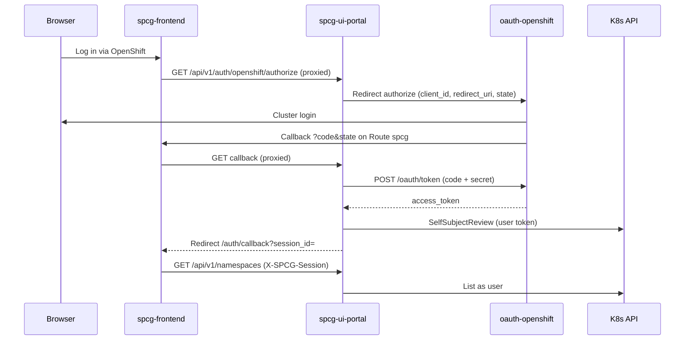
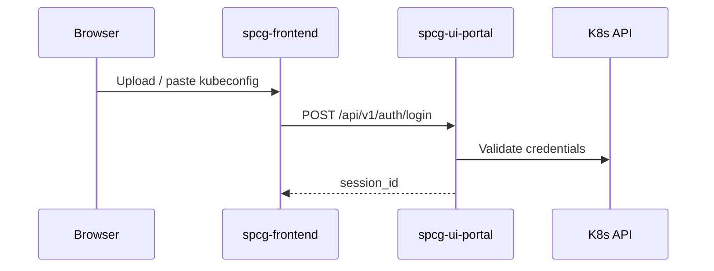

# SPCG architecture

Secure Packet Capture Gateway — namespace-scoped netobserv capture with a browser UI, admission limits, and optional Neo4j graph + AI triage.

**OpenShift security:** [openshift-security.md](./openshift-security.md)  
**Deploy:** [DEPLOYMENT.md](./DEPLOYMENT.md)  
**Hardened OpenShift overlay:** `manifests/overlays/openshift-secure` (landing / control / capture). Master plan: [SECURE-ARCHITECTURE-PLAN.md](./SECURE-ARCHITECTURE-PLAN.md)

---

## 1. Design principles

| Principle | Implementation |
|-----------|----------------|
| User identity, not portal SA | All K8s list/capture uses uploaded **OAuth token** or **kubeconfig** |
| Thin browser | Next.js proxies `/api/*`; SSE metrics; PCAP via download/S3 |
| Privilege isolation | `pcap-capture` privileged; frontend tier restricted PSS (`pcap-frontend` or `spcg-landing`+`spcg-control`) |
| Fail closed | Invalid session → 401; capture ownership checked per request |
| Tier via config | Small/Medium/Peak = Kustomize overlays + admission ConfigMap |

---

## 2. Runtime topology

```text
┌─────────────────────────────────────────────────────────────────┐
│ Browser → Route spcg (HTTPS)                                     │
│   spcg-frontend (Next.js)  ──middleware /api/*──► spcg-ui-portal │
└───────────────────────────────┬─────────────────────────────────┘
                                │ gRPC (optional mTLS)
┌───────────────────────────────▼─────────────────────────────────┐
│ pcap-capture (privileged)                                        │
│   spcg-backend-engine ◄── spcg-sensor-{session} (DaemonSet)      │
└───────────────────────────────┬─────────────────────────────────┘
                                │ User K8s API (443)
                                ▼
                     Pods / workloads in selected namespaces
```

| Image | Role |
|-------|------|
| `spcg-frontend` | Static UI; monolithic overlay proxies `/api` to portal; **openshift-secure** calls Route `spcg-api` directly |
| `spcg-ui-portal` | Auth, REST/SSE, PCAP session, Neo4j, AI |
| `spcg-backend-engine` | gRPC, sensor lifecycle, flow collectors |
| `neo4j:5.26-community` | Optional graph (base manifest) |
| `netobserv-ebpf-agent` | Per-capture DaemonSet (dynamic) |

**Quay (OpenShift):** `quay.io/moby/spcg-frontend`, `spcg-ui-portal`, `spcg-backend-engine` — tags in `manifests/openshift/kustomization.yaml`.

---

## 3. Authentication flows

### 3.1 OpenShift OAuth



- Redirect URI: `https://<route-spcg>/api/v1/auth/openshift/callback`
- Token URL: `https://<oauth-openshift>/oauth/token` (discovered; not legacy `oauth.openshift.svc`)
- Portal uses **`default` SA** + Route reader RBAC; user token on all API calls

### 3.2 Kubeconfig (optional)



Enabled when `SPCG_AUTH_METHODS` includes `kubeconfig` (default OpenShift overlay: `openshift,kubeconfig`).

---

## 4. Capture flow (summary)

1. User selects namespaces → workloads (`POST /api/v1/workloads`)
2. **Start capture** → admission check → engine deploys sensor DS → SSE stream to browser
3. **Stop** → teardown sensor, PCAP download or S3 presigned URL
4. Optional Neo4j sync + AI diagnostic modal

See prior sections in git history for detailed sequence diagrams; behavior unchanged.

---

## 5. OpenShift-specific components

| Piece | Location |
|-------|----------|
| Routes `spcg`, `spcg-api` | `manifests/openshift/route-openshift.yaml` |
| OAuth RBAC | `manifests/openshift/rbac-portal-oauth.yaml` |
| Auth ConfigMap | `manifests/openshift/config-auth-openshift.yaml` |
| Capture privileged SCC | `manifests/openshift/rbac-capture.yaml` |
| Overlay entry | `manifests/overlays/openshift-small` |

**Apply:** `oc apply -k manifests/overlays/openshift-small` + OAuthClient ([examples/openshift-oauth/README.md](./examples/openshift-oauth/README.md)).

---

## 6. Key code paths

| Concern | Path |
|---------|------|
| OAuth discovery | `internal/auth/openshift_discover.go` |
| Token exchange + TLS | `internal/auth/oauth.go` |
| User bearer client | `internal/k8s/impersonation.go` |
| OAuth handlers | `internal/portal/auth_oauth_handlers.go` |
| API proxy | `frontend/middleware.ts` |
| Auth UI | `frontend/app/page.tsx` |

---

## 7. What we deliberately do not do

- Portal SA is not cluster-admin
- Browser does not call `spcg-api` for JSON APIs (same-origin proxy only)
- No Dex sidecar — portal implements OAuth like Argo CD’s connector pattern
- No troubleshoot/debug panel in production UI (removed)
