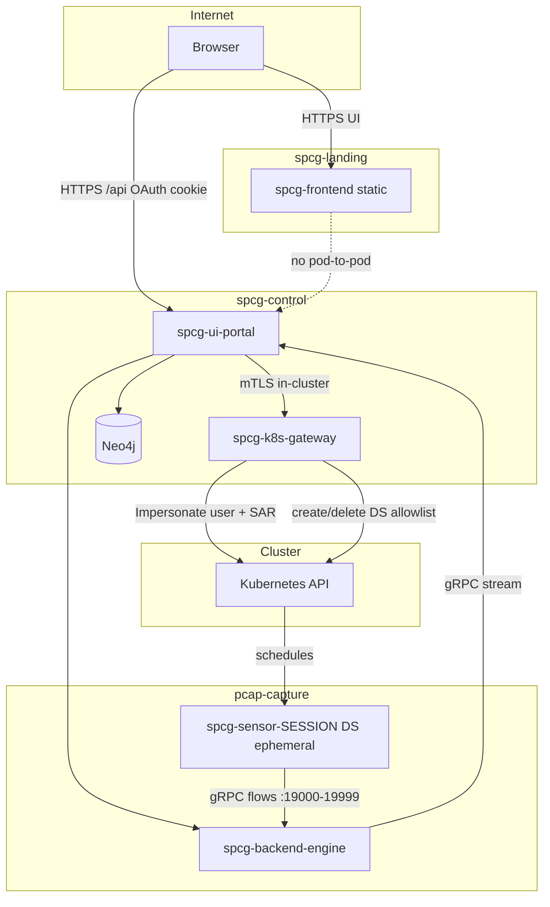

# SPCG secure architecture and execution plan

Target state for production OpenShift (and hardened vanilla Kubernetes): **landing namespace is presentation-only**, **control namespace holds all vetted logic**, **capture namespace holds privileged data plane**, **no sensor DaemonSet exists until a capture starts**, and **all Kubernetes API access goes through a dedicated gateway**.

This document is the master plan. Current product behavior is described in [ARCHITECTURE.md](./ARCHITECTURE.md) and [DEPLOYMENT.md](./DEPLOYMENT.md). Today’s namespaces are `pcap-frontend` + `pcap-capture`; migration renames/splits them as below.

---

## 1. Goals and non-goals

### 1.1 Goals

| Goal | Meaning |
|------|---------|
| **Minimal public surface** | Internet-facing pods cannot call the Kubernetes API, hold user tokens, or reach Neo4j. |
| **User-scoped cluster access** | List/deploy operations use the **logged-in OCP user’s** RBAC, not a platform super-user. |
| **Tenant isolation in SPCG** | User A cannot read user B’s capture sessions, PCAP, graph, or SSE streams (IDOR-safe). |
| **Ephemeral privileged footprint** | `spcg-sensor-*` DaemonSet exists **only** during an active capture; deleted on teardown. |
| **Vetted mutation path** | Only allowlisted K8s verbs/resources/namespaces; SubjectAccessReview before writes. |
| **Auditable control plane** | Every gateway call logged with OCP user, groups, capture id, target namespace. |

### 1.2 Non-goals (this phase)

- Replacing netobserv eBPF with a non-privileged collector (evaluate later; requires sensor regression).
- Multi-cluster federation from one UI (single API server per login session).
- Removing S3 offload feature (harden endpoints instead).

---

## 2. Threat model (summary)

| Attacker position | Desired outcome |
|-------------------|-----------------|
| Compromised **landing** pod (XSS → no server; or RCE on static/nginx) | Cannot reach API server, portal secrets, Neo4j, or other tenants’ data. |
| Compromised **ui-portal** pod | Cannot call K8s API directly; cannot bypass capture registry; limited egress. |
| Compromised **k8s-gateway** pod | Still only impersonates users with SAR; allowlisted resources; no cluster-admin. |
| Stolen **session cookie** | Access only that user’s captures; short TTL; logout wipes server state. |
| User with **legitimate OCP RBAC** to NS X | May capture only what RBAC allows in X (by design). |
| **Malicious capture target** (labels, hostNetwork bleed) | Sensor DS scoped to resolved pods; optional dedicated capture nodes. |
| **Policy injection** via UI | UI cannot create RoleBindings or SCC bindings; gateway rejects unknown API paths. |

---

## 3. Target namespace topology

| Namespace | PSS / SCC | Workloads | Holds secrets? | K8s API egress? |
|-----------|-----------|-----------|----------------|-----------------|
| **`spcg-landing`** | restricted | Static UI or Next **without** `/api` proxy | No | **No** |
| **`spcg-control`** | restricted | `spcg-ui-portal`, `spcg-k8s-gateway`, `spcg-neo4j` | Yes (graph, session, gateway SA) | **Gateway only** |
| **`pcap-capture`** | privileged (label) | `spcg-backend-engine`, `spcg-sensor-*` (ephemeral DS) | mTLS, minimal | Executor SA only (DS CRUD in capture NS) |

Rename map from today:

| Today | Target |
|-------|--------|
| `pcap-frontend` (UI + portal + Neo4j) | Split → `spcg-landing` + `spcg-control` |
| `pcap-capture` | Keep name or rename to `spcg-capture` (optional; plan uses `pcap-capture` for continuity) |

Label namespaces for NetworkPolicy selectors, e.g. `spcg.io/role: landing|control| capture`.

---

## 4. Component architecture



### 4.1 Component responsibilities

| Component | Responsibility | Must not |
|-----------|----------------|----------|
| **spcg-frontend** | Serve React/Next static assets; `NEXT_PUBLIC_API_ORIGIN` → control Route | Hold sessions, proxy kubeconfig, talk to API |
| **spcg-ui-portal** | Auth, capture registry, PCAP/SSE, admission, Neo4j sync, AI proxy (optional egress allowlist) | Direct `client-go` to API server in prod |
| **spcg-k8s-gateway** | Sole K8s client; impersonation; SAR; allowlisted mutations; audit log | Serve user HTTP; store PCAP |
| **spcg-backend-engine** | Per-session collectors; gRPC from sensors | User HTTP |
| **spcg-sensor-{id}** | eBPF capture for one session | Exist without active capture |
| **spcg-neo4j** | Graph store scoped by `authSessionId` + `captureId` | Ingress from landing |

### 4.2 Sensor lifecycle (no DS until capture)

**Already implemented in code** (`internal/capture/sensor/manager.go`):

1. User starts capture → engine/porta path calls `StartSession` → **create** `DaemonSet` `spcg-sensor-<sessionId>` in `pcap-capture`.
2. Wait until DS ready (timeout ~3m) → stream flows to collector port.
3. Teardown / logout purge → **delete** DS.

**Target policy (enforce in gateway + docs):**

- No `DaemonSet` with label `app=spcg-sensor` except name prefix `spcg-sensor-` tied to an active capture in registry.
- Reconciler (optional Phase D): delete orphan DS older than N minutes without registry entry.

---

## 5. Identity and authorization

### 5.1 Layers (all required)

```text
Layer 1 — OCP OAuth: who is the human?
Layer 2 — OCP RBAC: which namespaces/resources can they see via API?
Layer 3 — SPCG app roles: may they start capture, S3 offload, AI? (from OCP Groups)
Layer 4 — capture_registry: may this session id access this capture_id?
Layer 5 — Neo4j: queries filtered by authSessionId
```

### 5.2 Production login

| Mode | Dev/lab | Production |
|------|---------|------------|
| Kubeconfig upload | Allowed | **Disabled** |
| OCP OAuth bearer | Allowed | **Primary** |
| Session transport | `X-SPCG-Session` + HttpOnly cookie | Same + `Secure`, `SameSite=Strict` |

Portal stores **token reference or encrypted token** in control NS only (future: Redis with TTL for HA).

### 5.3 Gateway allowlist (v1)

| Verb | Resource | Scope | Notes |
|------|----------|-------|-------|
| get, list, watch | namespaces | cluster | User-filtered by RBAC |
| get, list, watch | pods, deployments, statefulsets, daemonsets, services | namespace | Workload picker |
| create, delete | daemonsets | **pcap-capture only** | Name `spcg-sensor-<sessionId>` only |
| — | secrets (cluster), nodes/proxy, pods/exec | **deny** | Unless later SAR-gated feature |

Every **create/delete** → **SubjectAccessReview** as impersonated user **and** check platform executor SA still performs DS apply (see §5.4).

### 5.4 Who creates the sensor DS?

**Option A (recommended):** Gateway uses **user impersonation** for SAR + read paths; **create/delete DS** uses dedicated **`spcg-pcap-executor` SA** in capture NS (today’s model) after portal validates capture ownership and targets. User RBAC does not need `privileged`; executor SA holds SCC.

**Option B:** User token creates DS (requires dangerous RBAC on users). **Do not use** for max-sec.

---

## 6. Network policy matrix (target)

Default **deny** ingress and egress per namespace; allow only:

| From | To | Ports | Purpose |
|------|-----|-------|---------|
| openshift-ingress / router | landing | 443→3000 | UI |
| router | control portal | 443→8080 | API + SSE |
| landing pods | — | — | **no egress** except DNS if required |
| portal | engine | 8443 | gRPC |
| portal | neo4j | 7687 | bolt |
| portal | gateway | 8443 (mTLS) | K8s operations |
| portal | allowlisted S3/API CIDRs | 443 | S3 offload, AI (optional) |
| gateway | API server CIDR | 6443/443 | K8s API only |
| engine | — | ingress from portal + sensors | collectors 19000-19999 |
| sensor DS | engine | 19000-19999 | flow export |

**Remove:** portal → world `443/6443`; frontend → portal pod egress (use public Route to API host instead).

---

## 7. Edge / Routes (OpenShift)

| Route host | Backend | Path |
|------------|---------|------|
| `spcg.apps.<cluster>` | landing Service | `/` |
| `spcg-api.apps.<cluster>` | portal Service | `/` (all `/api/v1/*`) |

Route annotations: SSE timeout on API route (existing HAProxy 5m). TLS: **re-encrypt** or edge terminate with strict cipher suites.

**CORS:** portal allows only `https://spcg.apps.<cluster>`.

**CSP (landing):** `default-src 'self'`; `connect-src` only API origin; no inline scripts without nonce.

---

## 8. Data flows

### 8.1 Login

```text
Browser → GET spcg (landing)
Browser → POST spcg-api/api/v1/auth/login (OAuth code or token exchange)
Portal → validates with OCP OAuth
Portal → creates auth session, stores user token in memory/Redis
Portal → returns Set-Cookie (HttpOnly) + X-SPCG-Session
```

### 8.2 List workloads

```text
Browser → GET /api/v1/namespaces (cookie)
Portal → gateway.ListNamespaces(impersonate user)
Gateway → SAR → API server
Portal → JSON to browser
```

### 8.3 Start capture

```text
Browser → POST /api/v1/capture/stream
Portal → admission limits
Portal → registerCaptureSession(captureId, authSessionId)
Portal → engine.StartCapture RPC
Engine → SensorMgr.StartSession → CREATE DS spcg-sensor-<id>
Sensor → engine collector
Engine → portal gRPC stream
Portal → SSE to browser
```

### 8.4 Teardown

```text
Browser → POST teardown / logout
Portal → purgeCaptureSessions, release streams
Engine → SensorMgr.StopSession → DELETE DS
Portal → Neo4j delete subgraph for captureId
Portal → wipe user token on logout
```

---

## 9. Code and manifest changes (inventory)

### 9.1 New components

| Artifact | Description |
|----------|-------------|
| `cmd/k8s-gateway/main.go` | gRPC or REST internal API for portal |
| `internal/k8sgateway/` | allowlist, SAR, impersonation, audit |
| `deploy/Dockerfile.gateway` | non-root image |
| `manifests/base/deployment-k8s-gateway.yaml` | control NS |
| `manifests/base/namespace-landing.yaml` | PSS restricted |

### 9.2 Refactors

| Area | Change |
|------|--------|
| `internal/k8s` / portal handlers | Portal calls gateway client instead of `UserClient` direct |
| `frontend` | `NEXT_PUBLIC_API_ORIGIN`; remove prod use of `app/api/v1` proxy |
| `internal/portal` | CORS lockdown; optional kubeconfig disable via env |
| `manifests/base/network-policies.yaml` | Split by namespace; remove broad egress |
| `manifests/openshift/route-openshift.yaml` | Dual host or path split |
| `internal/capture/sensor` | Optional orphan DS reconciler |

### 9.3 Unchanged principles

- `capture_registry` ownership checks on every capture API.
- Bounded topology / observability separation under load.
- mTLS engine↔portal in production overlays.
- Per-session DS create/delete (already correct).

---

## 10. Execution plan (phased)

### Phase 0 — Prerequisites (1 week)

| Task | Owner | Output |
|------|-------|--------|
| Cluster admin grants `spcg-pcap-executor` → `privileged` SCC (or custom SCC after sensor test) | Ops | DS can schedule |
| Document API server CIDR and S3 endpoints for NP allowlist | Ops | CIDR list in overlay |
| External Secrets for Neo4j + `GRAPH_MASTER_KEY` | Ops | No default passwords in prod |
| Threat model sign-off | Security | Approved §2 |

**Exit:** Neo4j and ui-portal run on current overlay; captures work.

---

### Phase 1 — Namespace split + network (2–3 weeks)

| # | Task | Type |
|---|------|------|
| 1.1 | Add `spcg-landing`, `spcg-control` namespaces + PSS labels | Manifests |
| 1.2 | Move Neo4j + ui-portal to control; frontend to landing | Manifests |
| 1.3 | Dual Route (UI vs API); frontend env API origin | Manifests + frontend |
| 1.4 | Rewrite NetworkPolicies per §6 | Manifests |
| 1.5 | Disable Next `/api` proxy in production image build | Frontend |
| 1.6 | Portal CORS + cookie flags | Portal |
| 1.7 | E2E: landing pod network test cannot reach `kubernetes.default` | Test |

**Exit:** Same features; landing has no API egress; API on separate host.

---

### Phase 2 — K8s gateway (3–4 weeks)

| # | Task | Type |
|---|------|------|
| 2.1 | Design internal API (protobuf or OpenAPI) for list workloads + DS lifecycle | Design |
| 2.2 | Implement gateway with impersonation + SAR + audit log | Go |
| 2.3 | Portal refactor to gateway client; remove direct API client in prod | Go |
| 2.4 | mTLS between portal ↔ gateway | Manifests + Go |
| 2.5 | NP: only gateway → API server | Manifests |
| 2.6 | Integration tests: deny exec/secrets; allow DS only in capture NS | Test |
| 2.7 | Load test list namespaces latency | Test |

**Exit:** ui-portal pod has **no** 6443/443 egress to API.

---

### Phase 3 — OCP OAuth + app roles (2–3 weeks)

| # | Task | Type |
|---|------|------|
| 3.1 | Register OAuth client on cluster | Ops |
| 3.2 | Portal login/code exchange; disable kubeconfig when `SPCG_AUTH_MODE=oauth` | Go + frontend |
| 3.3 | Map OCP Groups → `spcg-operator`, `spcg-viewer` | Go |
| 3.4 | Audit log fields: uid, groups, captureId | Gateway + portal |
| 3.5 | Session TTL + logout wipe | Portal |

**Exit:** Production uses OCP identity only; RBAC inherits from RoleBindings.

---

### Phase 4 — Hardening and assurance (2–3 weeks)

| # | Task | Type |
|---|------|------|
| 4.1 | Kyverno/Gatekeeper: deny privileged outside capture NS; deny hostNetwork in landing/control | Policy |
| 4.2 | Cosign image verify + digest pins in kustomize | CI/Ops |
| 4.3 | IDOR test suite (cross-session capture/graph) | Test |
| 4.4 | Optional orphan DS reconciler cron in control | Go |
| 4.5 | Central admission counter (not SSE-only) | Go |
| 4.6 | Pen test remediation | Security |
| 4.7 | Redis session store for portal HA (medium/peak) | Ops + Go |

**Exit:** README security TODO items checked off for prod profile.

---

### Phase 5 — Optional capture node pool (ops)

| Task | Notes |
|------|-------|
| Taint `capture-only` nodes | hostNetwork sensors isolated from generic workloads |
| Engine + sensor tolerate taint | Manifests patch |
| Document residual cross-NS visibility on shared nodes | Runbook |

---

## 11. Migration from current deploy

```text
1. Apply new namespaces alongside existing (no delete).
2. Scale down spcg-frontend in pcap-frontend; deploy landing copy.
3. Deploy portal + neo4j to spcg-control; update Routes.
4. Update NP; verify captures end-to-end.
5. Remove old resources from pcap-frontend after soak.
```

**Rollback:** Routes point back to monolithic `pcap-frontend` Service.

---

## 12. Acceptance criteria (production profile)

| # | Test |
|---|------|
| AC-1 | `oc exec` landing pod → `curl kubernetes.default` **fails** |
| AC-2 | `oc exec` portal pod → API server **fails** (gateway only) |
| AC-3 | No `spcg-sensor` DS in capture NS before capture start |
| AC-4 | After teardown, DS absent within 60s |
| AC-5 | User A cannot GET user B capture SSE or download (401/403) |
| AC-6 | Gateway rejects `pods/exec` with 403 |
| AC-7 | CORS from random origin **denied** |
| AC-8 | OAuth login only when `SPCG_AUTH_MODE=oauth` |
| AC-9 | OCP user without NS access cannot list that NS via SPCG |
| AC-10 | Audit log line per DS create/delete with user uid |

---

## 13. Diagram — trust boundaries

```text
┌─────────────────────────────────────────────────────────────┐
│ UNTRUSTED: Browser / Internet                                │
└───────────────────────────┬─────────────────────────────────┘
                            │ TLS
┌───────────────────────────▼─────────────────────────────────┐
│ LOW TRUST: spcg-landing (static only)                          │
└───────────────────────────┬─────────────────────────────────┘
                            │ TLS to API host only (no pod egress)
┌───────────────────────────▼─────────────────────────────────┐
│ MEDIUM TRUST: spcg-control                                     │
│   ui-portal — tenant data in RAM/S3; no K8s API               │
│   k8s-gateway — vetted API surface only                      │
│   neo4j — encrypted labels; session scoped                     │
└───────────────┬─────────────────────────┬───────────────────┘
                │ mTLS                     │ mTLS
┌───────────────▼──────────────┐  ┌──────▼──────────────────────┐
│ HIGH TRUST: pcap-capture      │  │ Kubernetes API               │
│   engine, ephemeral sensors    │  │ (user RBAC via gateway)      │
│   privileged SCC               │  └──────────────────────────────┘
└──────────────────────────────┘
```

---

## 14. References

- Current capture/sensor behavior: `internal/capture/sensor/manager.go`
- Capture ownership: `internal/portal/capture_registry.go`
- Network policies today: `manifests/base/network-policies.yaml`
- Security backlog: [README.md](../README.md#security-hardening-todo)
- Tier scaling: [architecture-tiers.md](./architecture-tiers.md)

---

## 15. Decision log

| Decision | Rationale |
|----------|-----------|
| Name gateway **`spcg-k8s-gateway`**, not kube-proxy | Avoid confusion with system kube-proxy |
| Keep per-session DS, delete on teardown | Already implemented; min privileged footprint |
| Executor SA creates DS, not end-user | Users need not hold privileged SCC |
| Split UI/API Routes | Landing pod needs zero backend access |
| OAuth for prod | Eliminate kubeconfig injection in browser |
